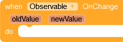
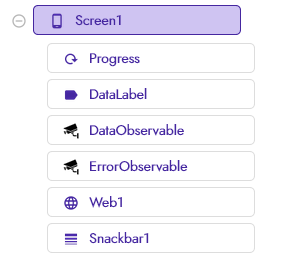
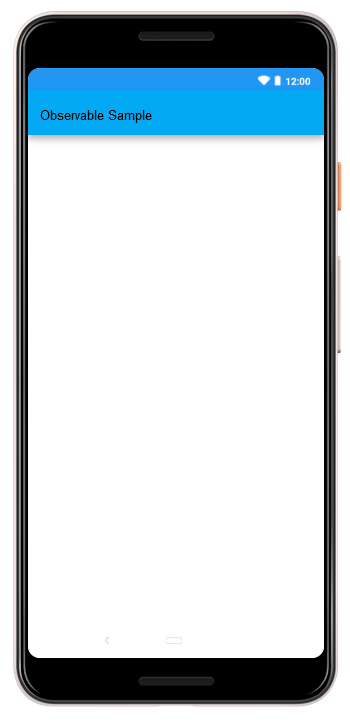
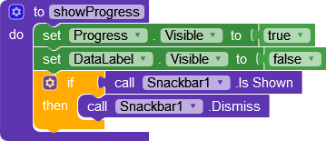
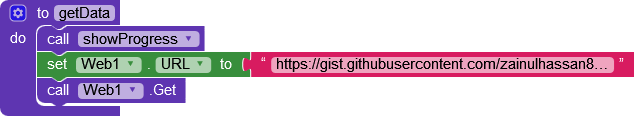
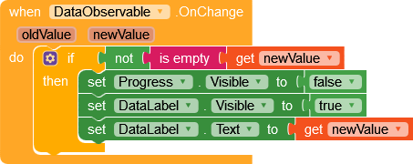
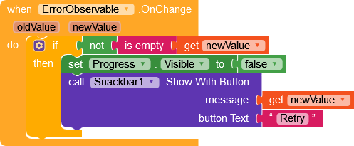
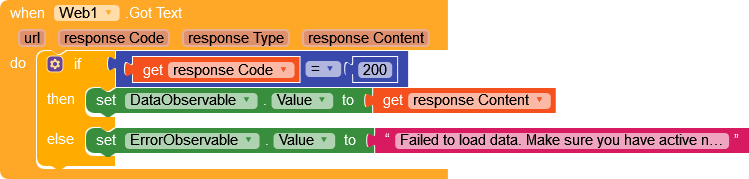
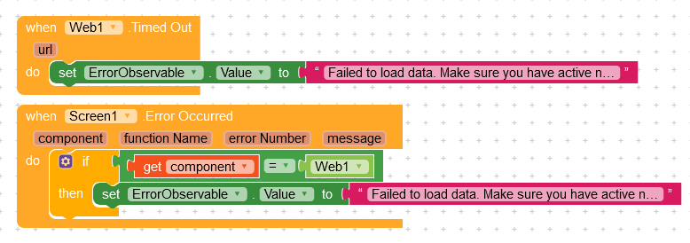
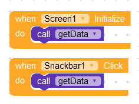

#  Observable Field

A utility extension to observe changes to a field. It can be used to simply general tasks used in everyday projects like changing UI when API request is successful, filtering list items etc.

## :closed_book: Documentation

> 
>
> Update value of observable. Calls the `OnChange` event with old a new value.

> 
>
> Get value of observable. Returns null if no value is set.

> 
>
> The event which is called after the change of the property is made. The value of the property has already been changed when this event is invoked.

---

## Usage
Let's create a simple project that loads a html file using `Web` component and displays it using a label. We will show `ProgressBar` while data loads and a `Snackbar` with retry button in case of an error.

### :computer: UI
 

###  Blocks

1. Lets start by creating a procedure that shows progressbar and hides other visible components.

> 

2. Next create a procedure `getData` that gets the file from network.

> 

3. We have added two observables called `DataObservable` & `ErrorObservable`. First one observes changes to data while the other observes changes to error. We can use the `OnChange` blocks from these observables tocperform different operations whenever data or error changes. When data changes, we will show data to the user & when error changes, we will show snackbar to the user.

> 
>
> 

4. Next we will use `Web.GotText` event to handle request result. If our request is successful, we will change the value of `DataObservable` other we will change value of `ErrorObservable`.

> 

5. To handle timeout and other network error, we will add blocks given below.

> 

6. Finally to get data when screen starts or when user clicks on retry button, we will use following events.

> 

### :file_folder: Project Files
- AIA File: [ObservableSampleSimple.aia|attachment](example/ObservableSampleSimple.aia)
- Advance Usage Sample: [ObservableSampleAdvance.aia|attachment](example/ObservableSampleAdvance.aia)
---

## Download Extension

### 1.0.0
- AIX File : [com.dreamers.observablefield.aix|attachment](out/com.dreamers.observablefield.aix)
